# HLD Master Notes — Corrected & Organized

> Built from your handwritten notes, reorganized topic-wise, with corrections and clarifications called out explicitly (look for **🔧 Correction** boxes). Diagrams are redrawn as Mermaid so they render cleanly.

---

## 1. Network Protocols

**Definition:** Network protocols are a set of rules and conventions that govern how devices communicate and exchange data over a network — they define standards for data encoding, transmission, and reception so devices can understand each other regardless of what hardware/software they run.

**Why they matter:**
- **Interoperability** — a shared way for different systems to exchange information
- **Reliability** — the rules don't shift over time, so both sides can rely on them
- **Efficiency** — protocols are optimized to minimize latency and packet loss
- **Scalability** — well-designed protocols make it possible to scale a system
- **Security** — protocols like SSL/TLS encrypt data in transit

### OSI Model (7 layers)

```
Application   ← where HTTP, FTP, SMTP, WebSockets live
Presentation
Session
Transport     ← TCP / UDP
Network       ← IP
Data Link
Physical
```

**🔧 Correction:** Your notes wrote "Transport ✓ (TCP/IP)" — this is a common mix-up. **TCP/IP is not one OSI layer**, it's a separate 4-layer model (Application, Transport, Internet, Link) that roughly maps onto OSI's 7 layers. TCP itself is a Transport-layer protocol; IP is a Network-layer protocol. "TCP/IP" as a phrase usually refers to the whole suite, not just Transport.

The two layers you'll actually be asked about in HLD interviews are **Application** and **Transport** — everything else is background context.

### Connection-oriented vs Connectionless

| | Connection-oriented (TCP) | Connectionless (UDP) |
|---|---|---|
| Setup | Handshake before data transfer | No setup |
| Speed | Slower (overhead of ACKs) | Fast |
| Ordering | Guaranteed order | No ordering guarantee |
| Use case | Where correctness matters (web, email, file transfer) | Where speed matters more than perfection (video calls, gaming) |

---

## 2. TCP (Transmission Control Protocol)

**Role:** One of the core protocols of the Internet Protocol Suite. Provides reliable, connection-oriented communication between devices on a network. Operates at the Transport layer.

**Functionality:** Establishes a connection *before* data transfer (the handshake), guarantees delivery of packets, and retransmits anything lost.

**3-Way Handshake:**

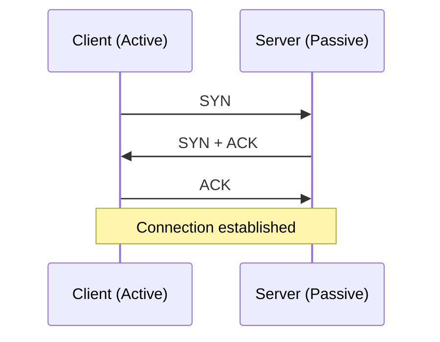

**Use cases:** Anywhere data integrity and sequencing matter — file transfer, email delivery, web browsing.

---

## 3. IP (Internet Protocol)

**Role:** Responsible for addressing and routing packets through networks.

**Functionality:** Assigns a unique IP address to every device and determines the best path for packets to reach their destination.

**Use case:** Fundamental to all networked systems — works together with other protocols (like TCP) for actual data transmission. (IP handles *addressing/routing*; TCP handles *reliability*.)

---

## 4. UDP (User Datagram Protocol)

**Role:** Same general purpose as TCP (moving data across a network) but **not reliable and not connection-oriented**. Simpler, minimal-overhead protocol.

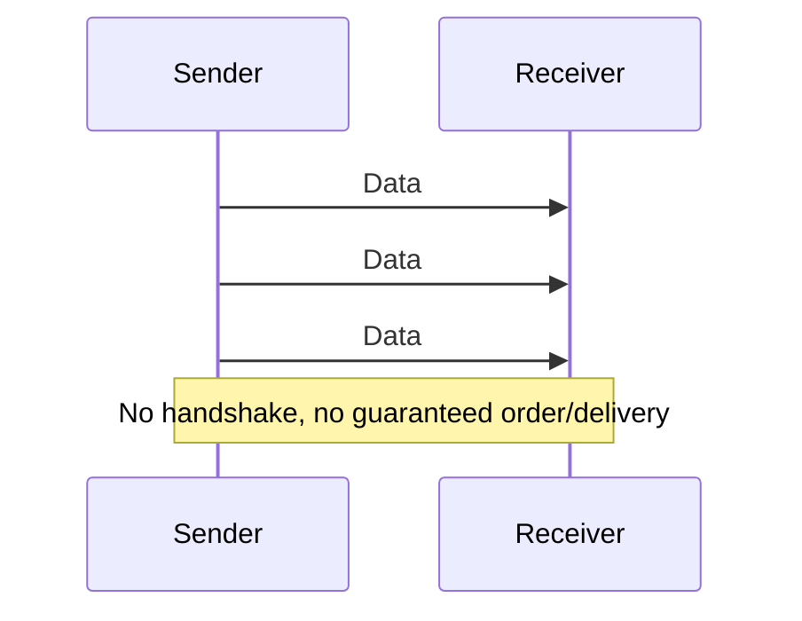

Often called "**fire and forget**" — it doesn't guarantee delivery or ordering of packets.

**Functionality:** Does not guarantee packet delivery or sequencing.

**Use cases:** Real-time applications like VoIP, online gaming, and live video streaming — where low latency matters more than occasionally dropping a packet.

---

## 5. HTTP and HTTPS

**Role:** HTTP is used for transferring hypertext files across the web (WWW).

**Functionality:** Defines how messages are formatted and transmitted between web servers and clients.

**Use case:** Used by web browsers to retrieve and display web pages.

**HTTPS** = HTTP + a layer of security via **SSL/TLS encryption**.

### SSL/TLS (Secure Sockets Layer / Transport Layer Security)
- Provides a stable and secure connection
- Encrypts information during transmission, ensuring confidentiality and integrity

**🔧 Note:** SSL is the older, deprecated version; **TLS is the modern standard** — people still say "SSL" colloquially, but if asked directly in an interview, say TLS is what's actually in use today.

---

## 6. FTP (File Transfer Protocol)

- Used for transferring documents between a client and server on a computer network (CN)
- Allows users to upload, download, and manipulate files on a remote server
- Uses **two connections**: a **control connection** (for commands) and a **data connection** (temporary, for the actual file transfer)

---

## 7. Email protocols — SMTP, IMAP, POP

- **SMTP (Simple Mail Transfer Protocol)** — used for **sending** email
- **IMAP** and **POP3 (Post Office Protocol)** — used for **receiving** email

**🔧 Clarification on your "IMAP+POP → Connection Oriented" note:** this is correct in spirit — IMAP is a stateful, connection-oriented protocol (it syncs and maintains mailbox state on the server across sessions), while POP is simpler and typically downloads-and-disconnects. Both ride on top of TCP (connection-oriented), unlike something like a UDP-based fire-and-forget protocol.

---

## 8. Proxy Servers

**Definition:** A proxy server acts as an intermediary between client devices and servers.

**Purpose:**
- Content filtering
- Privacy / anonymity
- Security and access control
- Load balancing
- Caching

**Types:** Forward proxy, Reverse proxy, Web proxy, Public proxy

**Advantages:** Enhanced security, improved performance, content control, load balancing
**Disadvantages:** Added latency, configuration complexity

---

## 9. CAP Theorem

**Definition:** A desirable-properties framework for a **distributed system with replicated data**. In a distributed system, you cannot simultaneously guarantee all three:

- **C — Consistency** — every read gets the most recent write (or an error)
- **A — Availability** — every request gets a (non-error) response, even if it's not the latest data
- **P — Partition Tolerance** — the system keeps working even when network communication between nodes breaks

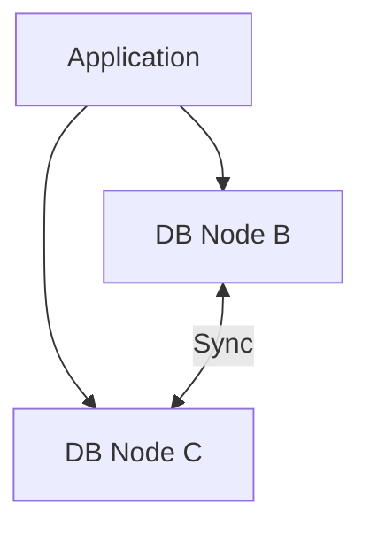

**Why you can't have all 3:** If nodes B and C become partitioned (can't sync with each other) and the application still needs to write to both, you have to choose: either **reject the write** (favoring Consistency, sacrificing Availability) or **accept the write on both sides and reconcile later** (favoring Availability, sacrificing Consistency). You cannot have instant, always-on, always-correct all at once during a partition.

- **Consistency** — if B has `a=4` and the app writes `a=5` on B, then C must replicate that value before C is allowed to serve a read of `a` — meaning the update has to be reflected everywhere in one shot.
- **Availability** — all nodes must respond, even if the data returned might be stale/inconsistent.
- **Partition Tolerance** — even if B and C can't talk to each other, the application (A) still gets *a* response from whichever node it reaches — meaning the system tolerates the network split.

> **"Always compromise between Consistency and Availability" — Brewer's Theorem** (this is correct — CAP theorem is also called Brewer's theorem/conjecture, after Eric Brewer).

**🔧 Important clarification not in your notes:** In real systems, **Partition Tolerance is not really optional** — networks *will* partition eventually, so in practice the real-world choice is between **CP** (consistent but may reject requests during a partition) and **AP** (available but may serve stale data during a partition). This is the framing interviewers actually expect.

---

## 10. ACID vs BASE (Database Properties)

### ACID (traditional relational DBs)

| Property | Meaning |
|---|---|
| **Atomicity** | A transaction happens completely, or not at all (all-or-nothing) — never partially applied |
| **Consistency** | The database moves from one *valid* state to another — all defined rules/constraints (e.g., foreign keys, uniqueness) hold before and after the transaction |
| **Isolation** | Concurrent transactions don't interfere with each other — each behaves as if it ran alone |
| **Durability** | Once a transaction is committed, it's permanent — survives a crash (backed up/persisted) |

**🔧 Important correction:** Your notes defined ACID's "Consistency" as *"data should be the same on all nodes"* — **that's actually CAP's definition of consistency, not ACID's.** These are two different concepts that happen to share a name:
- **ACID Consistency** = the database's internal rules/constraints are never violated by a transaction (e.g., a foreign key always points to a real row).
- **CAP Consistency** = all nodes in a distributed system see the same data at the same time.
It's one of the most common points of confusion in system design interviews — worth being extra clear on this distinction if asked.

### BASE (NoSQL / distributed systems)

- **BA — Basically Available** — the system guarantees availability (per CAP)
- **S — Soft state** — the state of the system may change over time, even without new input (as replicas converge)
- **E — Eventually consistent** — the system will *become* consistent over time, given no new updates

### Database examples

| DB | CAP leaning | Notes |
|---|---|---|
| **PostgreSQL** | CA (single-node) | Uses SQL, follows ACID, common in banking where consistency & correctness are critical, supports foreign keys for relational integrity across tables |
| **MongoDB** | CP | Primarily BASE-oriented historically, but modern MongoDB has added multi-document ACID transaction support; stores data as documents |
| **Cassandra** | AP | Sacrifices consistency for availability; peer-to-peer architecture (no single master) |

**🔧 Clarification:** Labeling a database as strictly "CA," "CP," or "AP" is a simplification — it depends heavily on configuration (e.g., MongoDB's consistency depends on read/write concern settings, and a single-node Postgres instance isn't really facing partition scenarios at all since there's nothing to partition). Treat these labels as "default leaning," not an absolute law, and be ready to explain *why* if pushed.

---

## 11. Microservices Architecture

### Monolithic vs Microservices

| | Monolithic | Microservices |
|---|---|---|
| Structure | All functionality in a single app (also called "legacy") | Each service is independently responsible for one business capability |
| Disadvantages | Overloaded codebase, hard to scale as it grows, deployment & CI/CD become painful | If services aren't partitioned correctly, distributed complexity creeps in |

**Microservices advantages:** easy to scale, easy to maintain, easy to integrate and deploy independently

**Microservices disadvantages (if poorly decomposed):**
1. **Latency increases** — more network hops between services
2. **Monitoring becomes difficult** — one service's issue can silently impact others
3. **Transaction management gets hard** — if one service's part of a transaction fails, the overall operation can end up inconsistent (this is exactly the problem the SAGA pattern solves — see below)

---

## 12. Decomposition Patterns

Two main strategies for breaking a monolith into services:

### A. Decompose by Business Capability
Split by what the business *does*. Example — an online ordering app:
1. Order Management
2. Product Management
3. Account Management
4. Login Management
5. Billing Management
6. Payment Management

### B. Decompose by Subdomain (Domain-Driven Design / DDD)
Go one level deeper — split each business capability into its constituent subdomains.

- **Order Management Domain** → Order Tracking, Order Placing, Order Returning
- **Payment Domain** → Forward Payment, Reverse Payment (refunds)

### The full decomposition pipeline (4 phases)

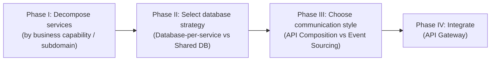

---

## 13. Post-Decomposition Patterns (handling cross-service transactions)

Once services are decomposed, three patterns solve the problems that emerge:

### 13.1 Strangler (Fig) Pattern
**Problem it solves:** "How do you migrate a legacy monolithic app to microservices without a risky big-bang rewrite?"

**Idea:** Incrementally build a new application *around* the legacy app, gradually routing traffic away from the old system — named after the way a strangler vine slowly overtakes and eventually replaces a tree.

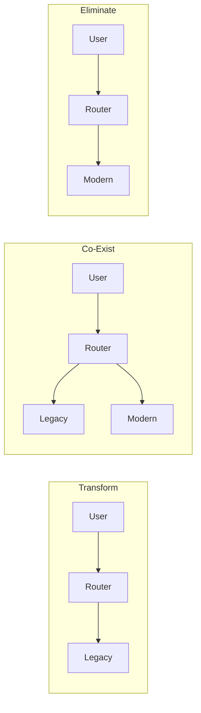

**Features:** gradual migration, co-existence of old and new during transition, strangling behavior (new system slowly takes over).

### 13.2 SAGA Pattern
**Problem it solves:** Data management/transactions across microservices, when each service owns its own database.

**The core tension:**
- **Database per service** → each service can guarantee ACID *locally*, but if an order touches Order/Inventory/Payment services, you can't wrap all three in a single ACID transaction anymore
- **Shared database** → you *could* do one ACID transaction, but you lose the whole point of microservices — a spike in one flow forces scaling the single shared DB, and it couples all services together

**Solution: SAGA = a sequence of local transactions.** Each service does its own local transaction, then triggers the next step. If any step fails, the SAGA sends **compensating (rollback) events** to undo the previous steps.

```
Order --[event]--> Inventory --[event]--> Payment
```

If Payment fails, a compensating event flows backward to reverse the Inventory reservation and cancel the Order.

There are **two ways to implement SAGA**:

**① Choreography** — no central controller. Each service publishes an event after its local transaction, and other services subscribe/react to it.

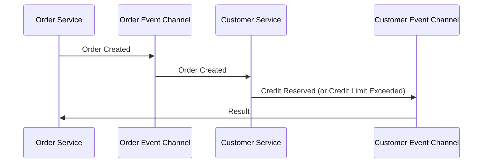

*Simple, decentralized, but hard to trace/debug as the number of services grows (no single place shows the whole flow).*

**② Orchestration** — a central orchestrator explicitly tells each participant what to do and waits for a reply before deciding the next step.

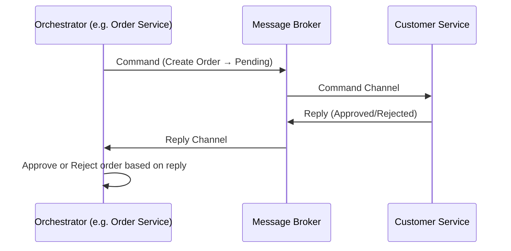

*Clear, centralized visibility into the flow, but the orchestrator becomes a more complex, critical component.*

**🔧 Correction:** your notes had a slightly circular phrase — "order service just takes care of its own services, it waits for commands by the orchestrator." To be precise: in orchestration, **the orchestrator issues commands** and participant services (like Customer Service) execute them and reply — the orchestrator itself isn't "waiting for commands," it's the one *giving* them and waiting for *replies*.

**Rollback example (illustrating a compensating transaction):** A pays 100 to B. B's step fails. The system needs to roll back — reverse A's debit and restore A to its original balance, since the multi-step transaction couldn't complete atomically.

### 13.3 CQRS (Command Query Responsibility Segregation)

**Idea:** Segregate the **write path** (Command: Create, Update, Delete) from the **read path** (Query: Select/Read) — often backed by *separate* data stores.

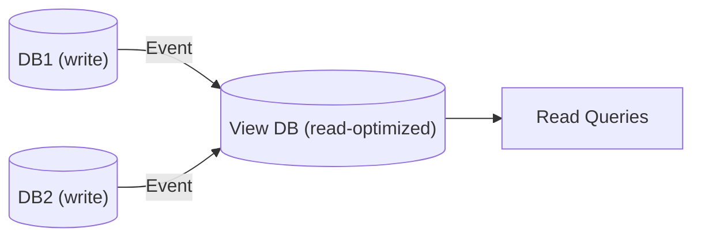

By propagating changes as **events** into a separate, denormalized read-optimized view, **there's no need for expensive cross-service joins at query time** — it behaves *as if* the data were joined, but the read path is actually fully independent of the write path's underlying services.

---

## 14. Scaling From Zero to Millions of Users

**Step 0 — Everything on one machine:** client and app+DB on a single server (typical of a college project / prototype).

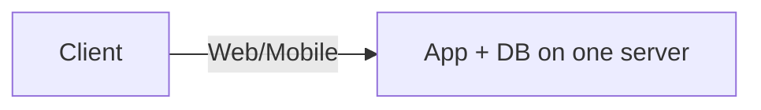

**Step 1 — Single server:** deploy the app on one dedicated server.

**Step 2 — Separate application & database servers:** distribute app logic and data onto different servers so each can scale independently.

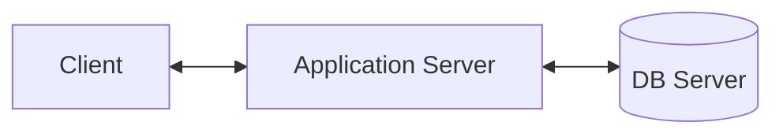

**Step 3 — Load balancer + multiple application servers:** when traffic comes in bulk, add a load balancer in front of multiple app server instances.

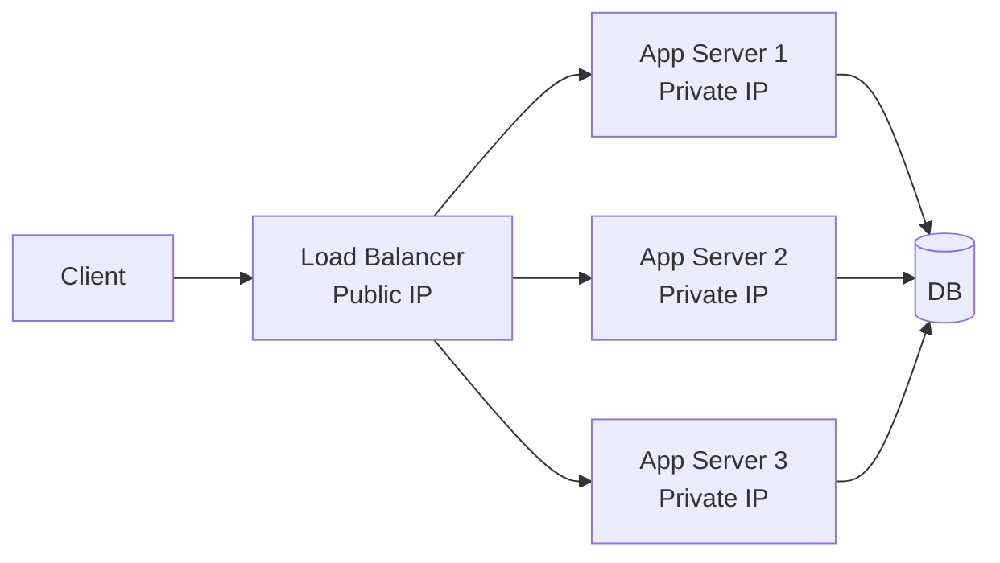

*Application servers use **private IPs**, reachable only through the load balancer — this improves security since the app servers aren't directly exposed to the internet.*

**Step 4 — Database Replication (Master-Slave):**

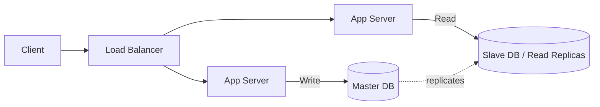

*Writes go to the master; reads are distributed across slave/replica databases — this offloads read traffic from the master and lets you scale reads independently.*

**Step 5 — Use of Cache:** cache is added between app servers and the DB to reduce direct DB calls and improve response time.

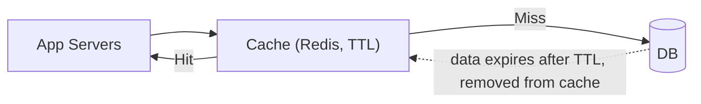

**Step 6 — CDN (Content Delivery Network):** CDN does caching too, but **not all caching is CDN** — CDN specifically caches static content at edge locations geographically close to users, improving latency for users worldwide, and also improves security since it removes the need for direct client access to your database/origin server.

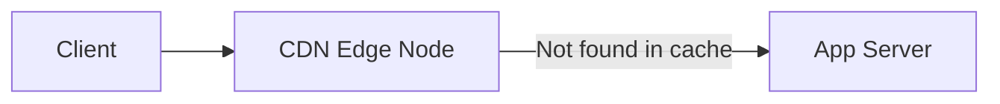

**Step 7 — Data Centers:** replicate the entire stack across multiple geographic data centers, so a client is routed to whichever is closest/available — improves both latency and availability (survives an entire data center outage).

**Step 8 — Message Queues:** decouple producers and consumers with an asynchronous messaging layer.

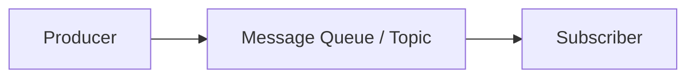

**Step 8b — Exchanges (e.g., RabbitMQ-style routing):** a producer sends a message with a routing key to an *exchange*, which decides which queue(s) it goes to.

| Exchange type | Behavior |
|---|---|
| **Direct** | Routing key must exactly match a queue's binding key |
| **Fanout** | Message goes to *all* bound queues |
| **Topic** | Message can be routed to *multiple* queues based on pattern matching |

---

## 15. Database Scaling

**🔧 Major clarification needed here** — your notes use "vertical" and "horizontal" for two *different* concepts, which is a common source of confusion:

1. **Scaling** (adding capacity to your database *tier* as a whole):
   - **Vertical scaling** = bigger machine (more RAM, more CPU, bigger disk)
   - **Horizontal scaling** = more machines (add DB instances)

2. **Sharding/Partitioning** (a technique *used within* horizontal scaling to split data across those multiple machines):
   - **Horizontal partitioning (sharding by rows)** = split rows across multiple tables/nodes, e.g., Table 1 holds users A–P, Table 2 holds users Q–Z
   - **Vertical partitioning (sharding by columns)** = split columns across multiple tables/nodes, e.g., Table 1 holds columns C1–C6, Table 2 holds columns C7–C10

So "horizontal" at the scaling level (more machines) is implemented *using* sharding, which itself can be done in a row-wise (horizontal) or column-wise (vertical) manner. Keep these as two separate axes in your head, not one.

**Problems introduced by sharding:**
- It can become **hierarchical** and **joins become impossible** across shards (you can no longer do a simple SQL JOIN across two different shards/nodes).
  - **Fix for the joining problem:** remove redundancy and dependency, and keep tables normalized so cross-shard joins are minimized in the first place.
  - **Fix for the hierarchical/rebalancing problem:** use **consistent hashing** (next section).

---

## 16. Consistent Hashing

Helps specifically with **horizontal scaling of sharded databases** (and load balancers).

### What hashing does
Hashing converts data of arbitrary length into a fixed-length value, for fast access.

```
"abcdefghij" → hash function → 1451 (example hashed value)
```

**Mod hashing** then maps that value onto a fixed number of nodes: if you have an array/cluster of 7 nodes,
```
1451 mod 7 = 2   → goes to Node 2
```

**🔧 Correction:** Your notes showed "807" as an intermediate value here, which doesn't match — `1451 mod 7` is actually **2** (207 × 7 = 1449, remainder 2). Worth re-deriving this by hand once so the math is clean in your head for an interview.

### The problem with plain mod hashing
The number of nodes isn't fixed in the real world — horizontal scaling means instances are added or removed. When the divisor (`n` in `mod n`) changes, **almost every key's target node changes too**, causing massive, unnecessary rebalancing (data has to move almost everywhere).

Example: going from 3 instances to 4 instances reshuffles the vast majority of key-to-node mappings, even though only one new node was added.

### The solution: Consistent Hashing
Consistent hashing minimizes rebalancing — on average, only about **1/n of keys** need to move when a node is added or removed (a huge improvement over "almost all keys move").

**How it works:**
1. **Take a virtual ring** (a circular hash space, e.g., 0 to 2³²−1) and place your servers on it using mod hashing of the server's identifier.
2. Each key is also hashed onto the ring, and is served by the **next server clockwise** from the key's position.

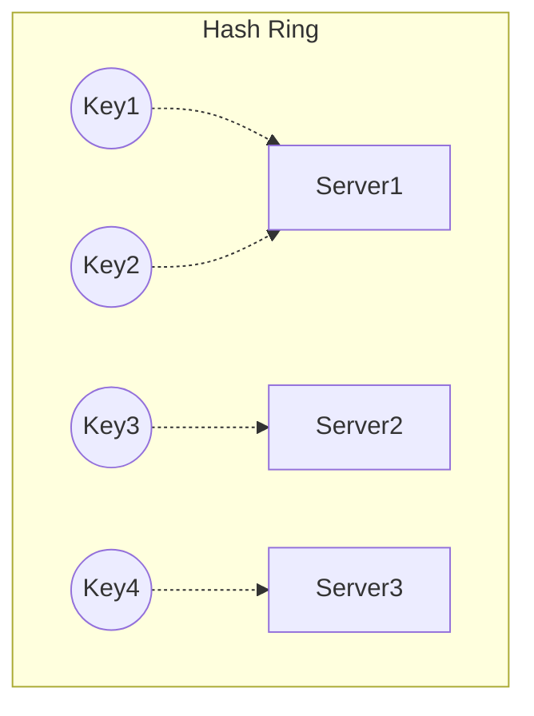

**Virtual Nodes:** to prevent overloading just one server (if the ring happens to place a server's position right next to a cluster of keys), each *physical* server is given multiple *virtual* positions spread around the ring — this evens out the load distribution.

**Replication for fault tolerance:** to avoid a single point of failure, a key is also stored on the next N−1 servers going clockwise around the ring (its replicas) — ideally chosen from **different data centers** for true fault tolerance.

**Where consistent hashing is used:**
1. Load balancing across application servers
2. Load balancing across database shards

---

## 17. Case Study — Design a URL Shortener

### Requirement
Generate a short URL that redirects to a long URL — a page with a long path and multiple query parameters should be shortenable too.

### High-level flow

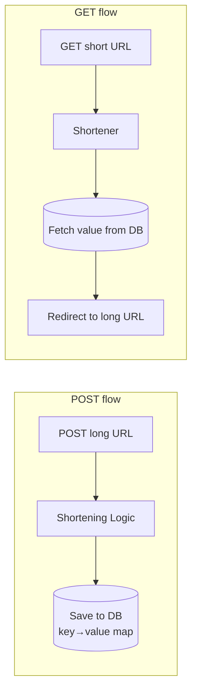

### Requirement Analysis (capacity estimation)

- **Traffic:** 10M URLs/day → 3,650M (3.65 billion) URLs/year
- **Retention:** assume links are kept for 100 years → 3,650M × 100 = **365 billion (365 × 10⁹) URLs total** to support
- **Character set:** `[0-9]` + `[a-z]` + `[A-Z]` = 10 + 26 + 26 = **62 characters**
- **Length needed:**
  - 62⁶ ≈ 56.8 billion — not enough for 365 billion
  - 62⁷ ≈ 3.5 trillion — comfortably covers it
  - **→ Finalize on 7-character short codes**

### How to generate the short code

**Option considered: hash the URL (MD5/SHA-1) and truncate**
- MD5 → 128 bits → 16 bytes. In hex, each byte = 2 hex digits, so 16 bytes = **32 hex characters** — way too long for a short URL, and truncating risks collisions.
- SHA-1 → 160 bits — even longer, same problem.

**Chosen approach: unique numeric ID + Base62 encoding**
Generate a unique, auto-incrementing numeric ID for each URL, then encode that number in Base62 (using the 62-character set above) to get a short, unique, collision-free code — much shorter and simpler than hashing.

### The real challenge: generating unique IDs at scale
You can't have all URL-creation requests hit a single database/counter to get the next ID — that becomes a bottleneck and single point of failure. Options considered:

1. **Ticket Server** — one dedicated server hands out sequential IDs. Simple, but it's a **single point of failure**.
2. **Snowflake-style ID (Twitter's approach)** — combines a timestamp + machine/worker ID + a per-millisecond sequence counter to generate unique IDs without a central coordinator.
   - **🔧 Correction:** your notes listed "same timestamp" as a disadvantage of Snowflake — but Snowflake IDs are specifically designed to include a **sequence number** that increments within the same millisecond on the same machine precisely *to solve* the same-timestamp collision problem. So this isn't really a flaw in Snowflake — it's the mechanism that fixes it.
3. **Zookeeper-based range allocation (marked as your best solution)** — a coordination service (like ZooKeeper) hands out non-overlapping ID *ranges* to each server (e.g., Server A gets 1–1,000,000, Server B gets 1,000,001–2,000,000). Each server then generates IDs independently within its assigned range — no central bottleneck per request, only an occasional range request.

### Final architecture

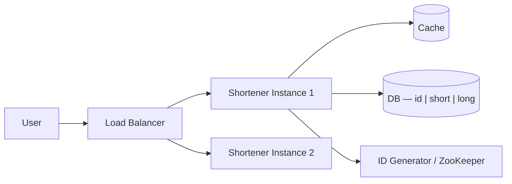

---

## 18. Back-of-the-Envelope Estimation

### Purpose
To roughly estimate the cost/resources of components so you can make informed decisions about what to use — without spending excessive time on precision.

### Guiding rules
- Do a **rough estimation** (think "T-shirt sizing," not exact numbers)
- **Don't spend too much time** on it
- **Keep assumption values simple** (10, 100, 500, etc.)

### Cheat sheet

| Zeros | Scale word | Storage unit |
|---|---|---|
| 3 | Thousand | KB |
| 6 | Million | MB |
| 9 | Billion | GB |
| 12 | Trillion | TB |
| 15 | Quadrillion | PB |

**Data size rules of thumb:**
- 1 character ≈ 1 byte (ASCII) or 2 bytes (Unicode)
- `long`/`double` ≈ 8 bytes
- An image ≈ 300 KB (rough average)

**Handy formulas:**
- `X million users × Y MB each ≈ XY TB` total storage
- `5 million users × 2KB each ≈ 10GB` data

### Worked Example — Facebook-style estimation

**Assumptions:** Total users = 1 Billion, Daily Active Users (DAU) = 25% = **250M**

**Traffic (QPS) estimation:**
- Assume each user does ~5 reads + 2 writes = 7 queries/day
- 250M users × 7 queries = 1.75 billion queries/day
- Divide by seconds/day (86,400 — rounded to ~100,000 for quick mental math) → ≈ 17,500–20,000 queries/sec
- **Round to ~10K–20K QPS** for planning purposes

**🔧 Note:** your original notes landed on "10K query/second" — that's in the right ballpark once you round 86,400 down to ~100,000 for simplicity (a valid back-of-envelope shortcut), though the more precise value is closer to ~20K QPS. Either is fine to say out loud in an interview as long as you show the math.

**Storage estimation:**
- Each user makes 2 posts/day, 250 characters each
- 1 post = 250 chars × 2 bytes (Unicode) = 500 bytes
- 1 user → 2 posts = 1,000 bytes = **1 KB/day**
- 250M users × 1KB = **250 GB/day** just for post text
- 10% of users post an image (300KB each): 25M users × 300KB ≈ **7.5 TB/day** for images
- **Total over 5 years** (~1,825 days, rounded to ~2,000 for simplicity):
  - Posts: 2,000 × 250GB ≈ **500 TB**
  - Images: 2,000 × 7.5TB ≈ **15 PB**

**RAM/Cache estimation:**
- Cache the last 5 posts per active user: 5 × 500 bytes = 2,500 bytes/user
- 250M active users × 2,500 bytes ≈ **625 GB** of cache needed
- If one machine holds 75GB in-memory → 625/75 ≈ **~9 machines needed**

**Server count estimation (latency-driven):**
- Target: 95% of requests under 500ms
- Assume each server has 50 threads, each thread serves ~2 requests/sec → 100 requests/sec per server
- Need to handle 10K req/sec → 10,000 ÷ 100 = **100 servers**

**Conclusion:** ~100 application servers, ~9-10 machines for caching, ~15PB storage — and this scale of system typically ends up choosing **AP** (Availability + Partition Tolerance) over strict Consistency, since a social feed doesn't need every user to see the exact same state instantly (eventual consistency is acceptable).

---

## 19. Case Study — Design a Key-Value Store (DynamoDB-style)

**Real-world example:** Amazon uses DynamoDB for features like "Add to Cart."

**Design goals:**
1. Scalability
2. Decentralization (no single master coordinating everything)
3. Eventual Consistency

**Design steps:** Partition → Replication → Get/Put Operations → Data Versioning → Gossip Protocol

### Step 1 — Partition
**Naive idea:** map each user directly to their data (e.g., their cart). **Problem:** this doesn't scale — you can't store every user's mapping on a single node as users grow.

**Solution:** Partition requests using **Consistent Hashing** — place servers on a virtual ring, each handling a range of the hash space (e.g., S1 handles 1–50, S2 handles 51–100).

**To avoid overloading one server:** use **Virtual Nodes**, distributing each physical server across multiple points on the ring.

### Step 2 — Replication
**To avoid a single point of failure:** replicate each key to additional servers.

Example: key `CAR-45` is served by **S1 (the coordinator)**. To maintain availability, it's replicated to **N−1 other servers** (e.g., S2, S3) — always chosen from **different data centers** for real fault tolerance.

This produces a **Preference List** per key — an ordered list of servers responsible for it:
```
S1 (Coordinator) → S2 (Backup) → S3 (Backup)
```

### Step 3 — Get & Put Operations

**Put operation:**
```
PUT(CAR) → find key (45) → "45-CAR" written to S1 (coordinator)
→ asynchronously replicated to S2, S3
```

**Quorum rule: R + W > N**
(Read replicas required + Write replicas required, must exceed total replica count N) — this guarantees that any read set and any write set overlap on at least one node, so a read is guaranteed to see the latest committed write. The write waits for a successful response from enough replicas before returning success.

**Get operation:** whenever a Get request comes in, the DB has to figure out how to route/merge responses. Two strategies:

| Strategy | Latency | Complexity |
|---|---|---|
| **Generic Load Balancer** | High latency | Simple to implement — any node can receive the request and forward via the preference list |
| **Partition Aware** | Low latency | The client already knows which node holds the data, skipping the extra hop |

### Step 4 — Data Versioning (handling concurrent/conflicting writes)

Walkthrough example:

1. **Put(CAR-45)** — all servers up → S1 (coordinator) writes `[45-CAR]-v1`, replicated to S2 and S3 → all three at v1
2. **Put(CART-45)** — an update, all servers up → all three updated to `[45-CART]-v2`
3. **Put(CARM-45)** — **S1 is down** → write only lands on S2, S3 → both go to `[45-CARM]-v3`, while S1 still has the stale `v2`
4. **Put(CARR-45)** — happening concurrently with step 3, while S1 is still down → say this lands only on S3 → `[45-CARR]-v4`
5. **Get(45)** — all servers now back up. The client fans out and gets **conflicting versions** back (e.g., S2 says CARM-v3, S3 says CARR-v4) — a genuine conflict, because two writes happened concurrently while a replica was down.

**This is why the system is labeled AP, not CP:** rather than blocking or erroring out, the system returns the conflicting versions to the application layer to resolve (or auto-resolves using a policy like "last write wins" or a merge function) — it prioritizes staying **available** even at the cost of **momentary consistency**.

**How conflicts are actually detected/tracked:** using a **Vector Clock** — a `(server, counter)` pair attached to each version, so the system can tell which versions are causally related (one is a strict update of another) versus genuinely concurrent/conflicting.

### Step 5 — Gossip Protocol
(Briefly referenced in your notes as step 5 but not detailed — worth knowing conceptually: nodes periodically exchange state information with a few random peers, so cluster membership and health information spreads across the whole system without needing a central coordinator — this is how nodes discover that other nodes have joined, left, or failed.)

### Why Eventual Consistency, ultimately
In a distributed system, you can't compromise on Availability and Partition Tolerance simultaneously with Consistency — so a system like this deliberately **compromises Consistency**, accepting that replicas converge *eventually* rather than instantly.

---

## 20. SQL vs NoSQL

### SQL (RDBMS)
- **Structured Query Language**, data lives in **tables (rows & columns)** with defined relationships
- **Structure:** requires a **predefined schema**
- **Nature:** centralized/concentrated — data typically lives complete on one server; doesn't natively split well across multiple servers
- **Scalability:** primarily **vertical** (bigger machine); horizontal scaling isn't natively well-supported
- **Property:** **ACID** — strong data integrity and consistency

### NoSQL
- **Non-relational / "Not only SQL"**
- **Structure:** unstructured/flexible schema
- **Types:** Key-Value, Document, Column-wide, Graph
- **Scalability:** **horizontal** by design (built to add nodes easily)
- **Property:** **BASE** — Basically Available, Soft state, Eventually consistent

### NoSQL types in detail

1. **Key-Value Store** — data stored as `key → value`, where the value is **opaque** (e.g., a plain string or blob) — you can only look values up **by key**, you cannot query *into* the value's internal structure. (e.g., Redis, DynamoDB)

2. **Document DB** — similar to key-value, but the value is stored as a structured document (JSON), and **you CAN query into the document's internal fields** (not opaque). (e.g., MongoDB)

3. **Column-wide DB** — data stored in a column-family format, efficient for retrieving specific columns across huge datasets. (e.g., Cassandra, HBase)

4. **Graph DB** — data stored as **Nodes** and **Edges** representing relationships, e.g.:
   ```
   (Sujal) --[learning]--> (System Design)
   ```
   Naturally suited to distributed storage since relationships can be traversed without heavy joins. (e.g., Neo4j)

### Comparison table

| | SQL | NoSQL |
|---|---|---|
| Query flexibility | Flexible, complex query support (joins etc.) | No complex query support (denormalized, avoids joins) |
| Relational? | Relational | Non-relational |
| Data integrity | ACID | No strict/immediate consistency guarantee |
| Availability | Lower (favors consistency) | High availability & performance, optimized for fast search, trades off strict consistency |

---

## 21. Case Study — High-Level Design of a Chat App (WhatsApp-style)

**Examples:** WhatsApp, Discord, Telegram, Slack, FB Messenger

### Requirement Gathering

**Functional:**
1. 1-to-1 send/receive text messages
2. Group message support
3. Last seen (online/offline status)
4. User login/authentication

**Non-functional:**
1. Scalability (handle huge traffic)
2. Low latency
3. Availability

### Back-of-the-Envelope Estimation

- Total users = **2 Billion** (assumption)
- DAU = **50M**
- Assume 1 user sends 10 messages to 4 people/day → 40 message-deliveries/user/day
- 50M users × 40 messages = **2 billion (2B) messages/day**
- 1 message ≈ 100 bytes
- 2B × 100 bytes ≈ **200 GB/day**
- **Over a year:** 200GB × 365 ≈ **73 TB/year**
- **Over 10 years:** 73TB × 10 ≈ **~730 TB total**

**🔧 Correction:** your notes had the 10-year figure written a bit ambiguously ("2000GB → 2TB × 365 → 730TB"). The clean chain is: **200GB/day → ~73TB/year → ~730TB over 10 years.**

### Why plain peer-to-peer doesn't work
Two clients talking directly (peer-to-peer) has no chat history, isn't scalable, doesn't support groups, and isn't fully available (both parties must be online simultaneously). **A central Chat Server is needed.**

### Why plain HTTP request/response doesn't work either
Standard HTTP is request-response only — the **server can't push** a message to a client that isn't actively asking for it. You need an improved protocol to *receive* messages in real time:

| Approach | How it works | Trade-off |
|---|---|---|
| **Polling** | Client repeatedly asks "any new messages?" on a fixed interval | Wastes bandwidth, adds delay equal to the polling interval |
| **Long Polling** | Client asks, server holds the connection open until there's new data (or a timeout), then client immediately re-asks | Less wasted traffic than polling, but still not truly real-time |
| **WebSocket** | Persistent, bidirectional, full-duplex connection — server can push data to the client anytime | Most efficient for real-time chat; connection-oriented and persistent |

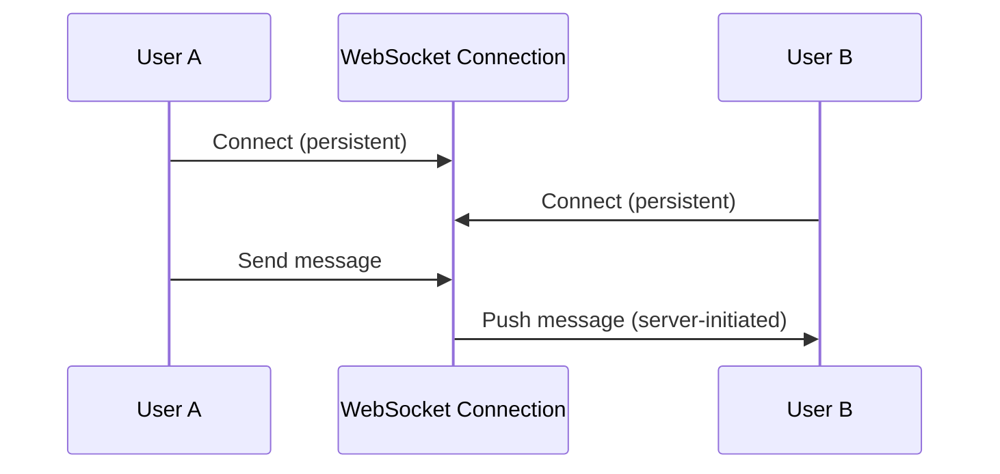

### User-Server Mapping Service

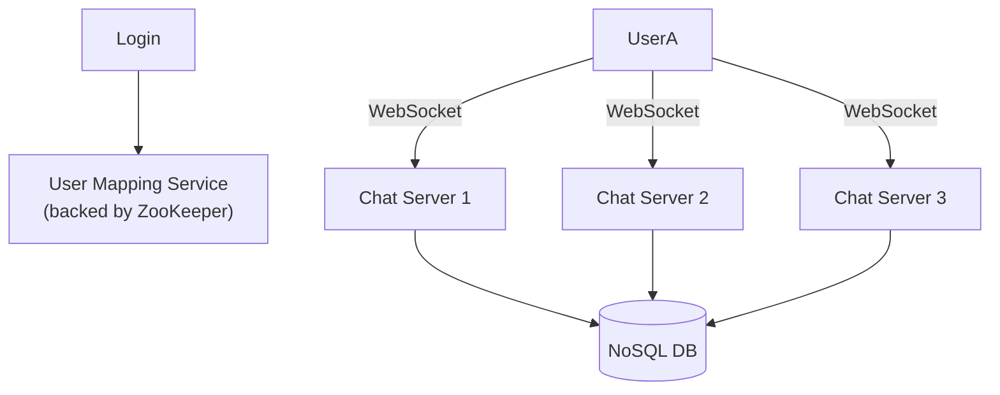

**Why this is needed:** any user can connect to *any* chat server (load-balanced across many instances). So when Client A wants to message Client B, A's chat server needs to know **which chat server B is currently connected to**, in order to route the message correctly. The mapping service (backed by something like ZooKeeper) maintains this `user → server` lookup.

**Send request shape:**
```
sendReq(from, to, message, type)   // type = "1-1" or "Group"
```

### Chat History Storage — SQL or NoSQL?

**Read operations:** view user list, group history, group members, user profile
**Write operations:** send message, update profile picture

**Any complex joins needed?** No → **lean NoSQL** (also gives lower latency for search/lookup, which matters for a chat app).

**Storage design (Column-wide DB, e.g., Cassandra):**

For **1-to-1 chats**:
```
| MessageId | From | To | Timestamp |
```
Partition based on the `(From, To)` pair, with ordering *within* a partition maintained by MessageId. When there are multiple partitions, ensure globally unique IDs (e.g., Snowflake-style) to avoid collisions across partitions.

For **Group chats** — partition key = `GroupId`:
```
| MessageId | GroupId | User-Sender | Message | Timestamp |
```

### Last Seen / Presence
A separate **Presence Service** periodically checks whether a user is online or offline, tracked through the live WebSocket connection state on the chat servers the user is connected to.

### Handling a chat server going down / user reconnecting
When a user logs in, the login flow checks with the User Mapping Service. If there's no valid server currently assigned (e.g., their previous server went down, or they're a fresh login), the mapping service assigns a **new** chat server. That new chat server then checks the database for any data specific to that user — e.g., **undelivered messages that arrived while they were offline** — and delivers them.

---

## Summary — Corrections Made to Your Original Notes

1. **OSI vs TCP/IP:** TCP/IP is a separate 4-layer model, not literally "the Transport layer" — clarified the distinction.
2. **ACID Consistency vs CAP Consistency:** these are different concepts that share a name — your notes had defined ACID's Consistency using the CAP definition. Both are now defined separately.
3. **CAP in practice:** added the practical framing that partition tolerance isn't really optional — real systems choose between CP and AP.
4. **"Vertical/Horizontal" used for two different things:** clarified that *scaling* (vertical = bigger machine, horizontal = more machines) is a different axis from *sharding/partitioning* (horizontal = split by rows, vertical = split by columns).
5. **Mod hashing math:** `1451 mod 7 = 2`, not 807 — recalculated.
6. **Snowflake ID "same timestamp" issue:** this isn't actually a flaw in Snowflake — the algorithm includes a per-millisecond sequence counter specifically to solve that problem.
7. **SAGA orchestration phrasing:** clarified that the orchestrator *issues* commands and waits for *replies* — it doesn't "wait for commands."
8. **Facebook QPS estimate:** showed the fuller math (86,400 sec/day rounds to ~100K for quick estimation, landing around 10K–20K QPS — both are defensible back-of-envelope answers).
9. **Chat app 10-year storage figure:** cleaned up the arithmetic chain (200GB/day → 73TB/year → ~730TB over 10 years).
10. **Database CAP labels (Postgres/Mongo/Cassandra):** flagged that these are simplifications depending on configuration, not absolute categorizations.
