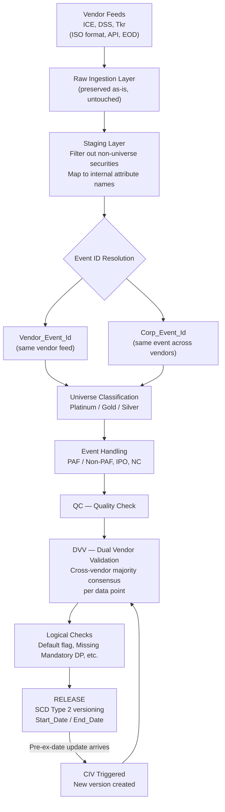
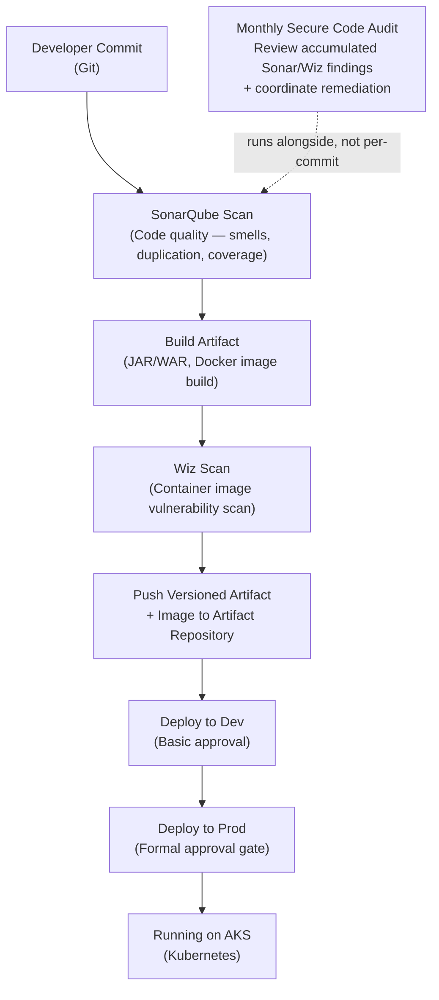
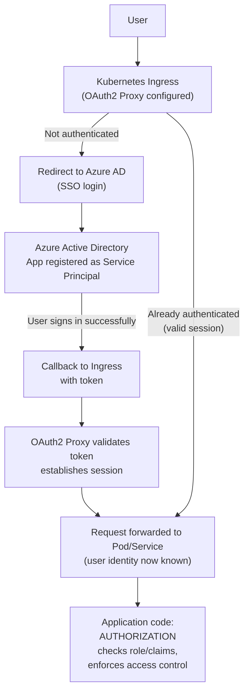
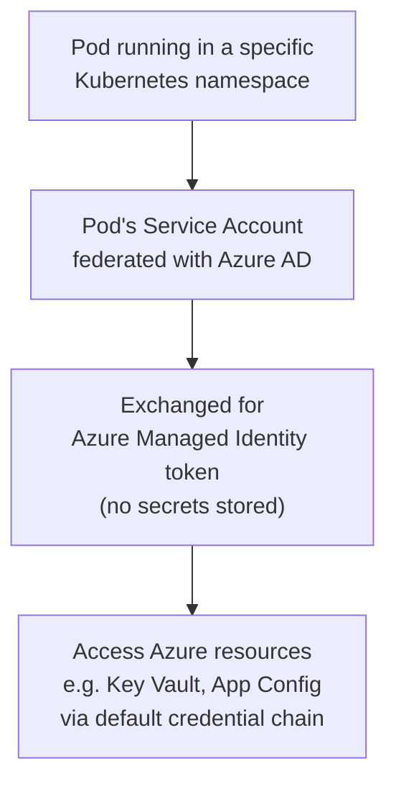

# Corporate Actions Processing Pipeline — MSCI Project Notes
### Interview Reference Document — Vivek Gupta

---

## 1. Overview — Full Spoken Walkthrough (5–7 minutes)

Use this as a script to internalize, not to memorize word-for-word. Speak it in your own voice, pause between sections, and let the interviewer jump in with questions.

---

**Opening — what the system does and why it exists**

"At MSCI, I worked on a core data engineering system responsible for tracking corporate actions — things like dividends, stock splits, mergers, rights issues — across global equity markets. Our clients rely on this data to make investment decisions, so accuracy and timeliness were both critical. The challenge is that this data doesn't come from a single source of truth. We received it from multiple third-party vendors — ICE, DSS, and Tkr — and each vendor could report the same real-world event slightly differently, or at different times, or with conflicting values. So a large part of what I worked on wasn't just moving data from A to B, it was building the logic to reconcile, validate, and version that data reliably at scale — we were processing over 200,000 security records daily, each with 40-plus attributes."

**Ingestion and staging**

"The pipeline starts with ingestion. Each vendor delivers their feed once a day, end-of-day, over an API, in a standardized ISO format. The first thing we did was store that data exactly as received, completely untouched, in a raw layer. That was a deliberate design decision — if something went wrong three steps downstream, we needed to be able to go back and see exactly what the vendor actually sent us, rather than relying on them to resend it. From there, data moved into a staging layer, where we filtered out securities that weren't part of our tracked universe, and mapped each vendor's attribute names onto our own internal, standardized naming convention. That step alone took us from over 40 raw attributes down to about 20 that were actually business-relevant."

**Identity resolution — the hard problem**

"The part of this system I'd say I'm proudest of is the identity resolution logic. Because we're getting the same corporate event from multiple vendors, we needed two separate identifiers, at two different scopes. First, a Vendor_Event_Id, which identifies a specific record coming from a specific vendor's feed — built from that vendor's own primary key, the security's Sedol, and the exchange it's listed on. Second, a Corp_Event_Id, which identifies the same real-world event across all vendors — built from the event type, a key date, an identifier, and the dividend type, where event type was the one field that could never be null. If those keys matched an existing record, we treated it as the same event and reused the ID. If not, we generated a new one. And there was a fallback path too — if the Corp_Event_Id keys didn't resolve cleanly, we'd fall back to checking the vendor-specific key, and if that matched, we knew it was an update to something we already had, rather than a brand-new event. Getting this logic right was what let us avoid duplicating events or, worse, silently overwriting one event's data with another's."

**Classification and event handling**

"Once an event was identified, we classified the underlying security into tiers — Platinum for index-constituent securities, Gold and Silver based on market cap thresholds — which let us prioritize processing and review effort based on how impactful that security was to our clients. We also handled a few special states: whether an event was Price Adjustment Factor applicable or not, how IPOs were handled — loaded initially and validated by a user through the UI — and a No Change state for when a vendor simply didn't resend a feed, meaning we assumed the prior data still held."

**Validation — the consensus layer**

"After a quality check stage, every individual data point went through what we called Dual Vendor Validation. This was a cross-vendor consensus check — for a given data point, we'd compare the values reported by each vendor pairwise, and if a majority of those comparisons agreed, that value was considered validated and safe to release. This mattered a lot, because it meant no single vendor sending bad or stale data could corrupt what we published downstream — we needed agreement, not just a single source. After that, we ran a set of logical checks — for example, if a corporate action gave the client a choice between cash or stock and they hadn't made a selection by the ex-date, a default option was automatically assigned, along with checks for missing mandatory fields and a number of other business rules."

**Release and change handling**

"Once a record passed all of that, it was released downstream. But corporate actions data isn't static — a vendor might revise a value after we've already published something, as long as it's before the event's ex-date. When that happened, we generated a new version of that event, which went back through the same validation pipeline — including Dual Vendor Validation again — before it replaced the previously released version. Every version was tracked with a start and end date, so we always knew exactly what value was live at any point in time, and we had a clean audit trail of how an event evolved from first being reported to its final, ex-date-confirmed state."

**Closing — why this mattered**

"What made this project interesting from an engineering standpoint wasn't just the data volume, it was designing a system that could reconcile inherently inconsistent, multi-source data automatically, stay auditable, and still be correctable after the fact without losing history. I worked across the full stack of this — Java and Spring Boot for the processing services, Oracle and MongoDB for the data layer, and I was also responsible for modernizing a lot of the legacy stored-procedure-based logic into proper, testable Java code as part of this effort."

---

### Delivery tips
- **Pace yourself** — don't rush the identity resolution section; it's the most technically impressive part and interviewers often dig in here.
- **Pause after "release and change handling"** — this is a natural spot for the interviewer to ask "how did you version that?" — let them ask rather than over-explaining upfront.
- **If asked to shorten:** cut the "Closing" paragraph first, then compress "Classification and event handling" into 2 sentences — the ingestion, identity resolution, and validation sections are the core of the story.

---

## 2. End-to-End Pipeline Diagram



---

## 3. Ingestion Layer

| Aspect | Detail |
|---|---|
| Vendors | ICE, DSS, Tkr |
| Format | ISO standard, delivered via API |
| Frequency | EOD (End of Day) |
| Raw layer purpose | Data stored exactly as received, untouched — preserved to debug/reconcile issues later without depending on the vendor to resend |

**Why this matters (interview angle):** Preserving raw vendor data separately from processed data is a classic data-engineering best practice — it decouples "what we received" from "what we derived," which is critical for auditability and root-cause analysis.

---

## 4. Staging Layer

- **Filtering:** Drop securities outside the tracked universe (irrelevant/non-universe securities removed early to reduce downstream load).
- **Mapping:** Vendor-specific attribute names (40+ raw attributes) are normalized/mapped to internal international attribute names, retaining ~20 business-relevant attributes.

---

## 5. Event Identification — Dual Key Model

Two separate identity concepts are maintained, at different scopes:

### 5.1 Vendor_Event_Id — *same record, same vendor feed*
**Composite key:**
```
Corp_Action_Ref (vendor's own PK) + Sedol (country-level security ID) + Place of Listing (exchange identifier)
```
- Match found → reuse existing `Vendor_Event_Id`
- No match → create new `Vendor_Event_Id`

### 5.2 Corp_Event_Id — *same real-world event, across all vendors*
**Composite key:**
```
Event_Type + Key_Date + Identifier + Dividend_Type
```
- `Event_Type` is **mandatory** (never null); all other fields in the key **can** be null
- Match found → reuse existing `Corp_Event_Id`
- No match → create new `Corp_Event_Id`

### 5.3 Fallback / Update Detection Logic
If the `Corp_Event_Id` key doesn't cleanly resolve a match, fall back to checking:
```
Corp_Action_Ref + Sedol + Place of Listing
```
- If **that** matches an existing record → treat as an **update**, reuse both `Vendor_Event_Id` and `Corp_Event_Id`
- If not → treat as a **brand-new event**, generate both IDs fresh

**Why this matters (interview angle):** This is an idempotent key-resolution strategy that solves a hard real-world problem — the same corporate event arrives from multiple vendors with different vendor-specific references, and you need a reliable way to know "is this a new event, an update to an existing event, or a duplicate from a different vendor of an event we already have?"

---

## 6. Universe Classification

| Tier | Criteria |
|---|---|
| **Platinum** | Index-constituent securities |
| **Gold** | Meets market cap (mcap) threshold |
| **Silver** | Below market cap threshold |

Used to prioritize processing effort / SLA tightness based on how "important" a security is to clients.

---

## 7. Event Handling States

| State | Meaning |
|---|---|
| **PAF** | Price Adjustment Factor applicable |
| **Non-PAF** | Price Adjustment Factor not applicable |
| **IPO** | Initially loaded and validated by user via UI; any later update is treated as a CIV |
| **NC** | No Change — applied when a vendor doesn't resend a feed (prior state assumed to still hold) |

---

## 8. QC (Quality Check)

Intermediate validation gate before data points are compared across vendors.

---

## 9. DVV — Dual Vendor Validation

**Cross-vendor consensus check** applied to each individual data point before it can be released.

**Logic (majority rule / quorum-based reconciliation):**
```
Given vendors V1, V2, V3:
  Check  V1 == V2   OR   V2 == V3   OR   V3 == V1
  If majority of these hold → value is validated for release
```

**Why this matters (interview angle):** This is essentially a **quorum-based data reconciliation algorithm** — it protects the golden record from being corrupted by a single vendor sending bad, stale, or malformed data. Good to compare conceptually to distributed-systems quorum reads (e.g., Dynamo-style N/W/R quorums) if the interviewer digs deeper.

---

## 10. Logical Checks (post-DVV)

Run after a data point passes DVV:

- **Default flag** — e.g., for a cash-vs-stock election event, if the stakeholder does not choose an option before the ex-date, a default option is automatically assigned.
- **Missing Mandatory DP** — checks that all mandatory data points are populated.
- ...and additional business-rule-driven checks.

---

## 11. Release — SCD Type 2 Versioning

Every `Corp_Event_Id` record carries a validity window:

| Field | Behavior |
|---|---|
| `Start_Date` | Set to `sysdate` when the version becomes current |
| `End_Date` | Set to `31-12-2075` (sentinel value = "still open/current") |

**On update:**
1. Existing record's `End_Date` → set to `sysdate - 1` (closed out)
2. New record inserted with the **same `Corp_Event_Id`**, `Start_Date = sysdate`, `End_Date = 31-12-2075`

**Why this matters (interview angle):** This is a textbook **Slowly Changing Dimension Type 2** pattern — full point-in-time history is preserved for every event while there's always exactly one unambiguous "current" version. Great to name-drop as SCD2 in an interview; shows you understand the pattern by name, not just by accident.

---

## 12. CIV — Post-Release Correction Handling

**Trigger condition:**
- A `Corp_Event_Id` has already been **released** (passed DVV, published downstream)
- The event's **ex-date has NOT yet occurred**
- A vendor sends an **update to a data point that was already released**

**Result:**
- A **new event/version is generated** for the same `Corp_Event_Id`
- It **re-enters the pipeline** and goes through **DVV again**
- Once validated, it's released as the new current version (triggering the SCD2 close-old/open-new cycle again)

**Why this matters (interview angle):** CIV is the business trigger that *causes* re-versioning — it shows you understand not just the static data model (SCD2) but the event-driven lifecycle that drives it. Ties DVV + SCD2 + event sourcing together into one coherent story.

---

## 13. Legacy Modernization — Full Spoken Walkthrough (2–3 minutes)

This maps to your resume line: *"Modernized and unified legacy applications using Java, Spring Boot 3, and Spring 6, improving application maintainability, scalability, and overall system performance."* Use this as a follow-up deep-dive script when asked "tell me more about that modernization work."

---

**Setting up the legacy state**

"The legacy version of this application had a few things that made it hard to maintain and scale. Configuration was entirely XML-based — bean wiring was done through `applicationContext.xml` files rather than Java config. Business rules were implemented using Drools, a separate rules engine with its own `.drl` rule files. And the daily processing was driven by a batch processor framework. As part of modernizing this to Spring Boot 3 and Spring 6, I worked on replacing all three of these."

**XML config → Java-based config**

"First, we moved from XML-based configuration to Java-based configuration — `@Configuration` classes with `@Bean` methods, and relying on component scanning and stereotype annotations instead of explicit XML bean definitions. This gave us compile-time safety — if you renamed or removed a class, the IDE and the build would catch broken references immediately, instead of failing silently at runtime the way XML wiring sometimes did. It also aligned much better with how Spring Boot 3 is designed to work, since auto-configuration and annotation-driven setup is the framework's default philosophy now."

**Drools → Chain of Responsibility in Java**

"Second, we removed Drools entirely and reimplemented the business rules directly in Java, using the Chain of Responsibility pattern. Each rule became its own handler in a chain, and a record would pass through each rule handler sequentially. This mattered for a few reasons. Rules were now plain Java, so they went through the same code review, unit testing, and CI pipeline as the rest of the codebase, instead of living in separate `.drl` files that our normal test suite didn't naturally cover. Debugging also became simpler — instead of reasoning about how the rules engine evaluated a rule set, you could just step through a debugger like any other Java code. And conceptually, Chain of Responsibility was a good fit because it mirrors what a rules engine does — sequential, composable evaluation — but in a structure that's transparent and testable."

**Batch processor → staging-layer Batch_Id with rolling retry**

"Third, and this is probably the part I'm most proud of — we removed the batch processor framework and replaced it with a simpler, more resilient mechanism built into the staging layer itself. When a set of securities came in for processing, we'd generate a Batch_Id for that run. Each security in the batch would be processed, and on success, its status was marked OK against that Batch_Id. If a security failed to process, it wasn't lost or immediately requeued — instead, the next batch run would automatically pick up any unprocessed securities from the last seven days, using a rolling sysdate-7 to sysdate window, along with whatever new securities had just come in. So failures would naturally get retried alongside new data in subsequent runs, without needing manual intervention or a separate retry framework. And by capping that window at seven days, we avoided an ever-growing backlog of stale failures quietly retrying forever — anything still failing after seven days would need to be looked at separately rather than silently retrying indefinitely."

**Wrap-up**

"Overall, this modernization took us from a stack with three separate, harder-to-maintain technologies — XML config, a rules engine, and a batch framework — down to a simpler, fully Java-based approach that was easier to test, easier to debug, and more resilient to transient failures, without losing any of the functionality the legacy system had."

---

### Delivery tips
- If time is short, lead with the **batch retry redesign** — it's the most "systems thinking" heavy piece and tends to generate the best follow-up questions.
- Be ready for: *"After 7 days, what happens to a security that's still failing?"* — answer honestly. If you're not fully sure whether it fed into an exception report or required manual review, say "I'd need to check the exact downstream handling, but failures beyond that window would need separate attention rather than silently retrying" — that's a safe, honest answer.
- Be ready for: *"Does your rule chain short-circuit on the first failure, or do all rules run and accumulate results?"* — decide/recall your actual answer before the interview, since this is a natural next question given the Chain of Responsibility mention.

---

## 14. Stored Procedure → Java Migration — Full Spoken Walkthrough (2–3 minutes)

This addresses a project where core business logic lived in a stored procedure, called directly from the Java process, and was later migrated into the Java codebase. Use this when asked "walk me through that migration" or the harder follow-up: "why move it to Java if a stored procedure is faster?"

---

**Setting up the context**

"On one of the projects I worked on, a significant piece of business logic lived entirely inside a stored procedure — the Java process would simply call that procedure and use its output. Over time, we decided to move that logic out of the stored procedure and into our Java codebase."

**Addressing the performance objection directly**

"Now, a stored procedure executing close to the data can genuinely outperform equivalent Java logic for bulk operations, and I want to be upfront that raw performance wasn't actually our concern here. This particular process only ran once or twice a day, so execution speed had a lot of headroom — it was never going to be a bottleneck either way. What was actually painful was production debugging. When something broke inside the stored procedure, we had very limited visibility — we were mostly relying on DB logs, without the ability to step through the logic or get clean stack traces the way we could in Java. So the decision was purely about maintainability and operational debuggability, not speed."

**How the migration was done**

"To migrate it, I first went through the stored procedure end-to-end to fully understand the logic — the tables it touched, the business rules it encoded, and any conditional branches. I then broke that logic into discrete units that mapped cleanly to Java service methods, and reimplemented it using our standard data access layer instead of SQL-level cursors and loops.

For validation, we didn't just rewrite it and assume it was correct — we ran the stored procedure and the new Java logic in **parallel, in production, against two separate databases, for about a month**. Each run, we exported both outputs and reconciled them using VLOOKUP in Excel to catch any missing or mismatched records. Only once we were confident, after that month of parallel running, that the outputs matched consistently did we cut over fully to the Java implementation."

**Wrap-up**

"That gave us a much more maintainable, testable, and debuggable piece of business logic, without any real performance trade-off given how infrequently the process ran — and we had a full month of production parallel-run data giving us confidence before we ever relied on the new logic alone."

---

### Delivery tips
- If the interviewer leads with the performance objection, **don't get defensive** — concede the point ("you're right, a stored procedure can be faster for bulk operations") before pivoting to why speed wasn't the deciding factor. Conceding a true point first makes the rest of your answer land better.
- Have the **"once or twice a day"** frequency ready immediately — it's the fact that neutralizes the performance objection before it becomes a real challenge.
- The **VLOOKUP/Excel reconciliation over a month** is a strong, concrete detail — don't skip it. It's the kind of unglamorous rigor that makes senior interviewers trust the rest of your story.

---

## 15. CI/CD Pipeline — Full Spoken Walkthrough (2–3 minutes)

This maps to your resume line: *"Managed Azure DevOps CI/CD pipelines for automated build, testing, and deployment, and performed monthly secure code audits to identify and remediate application vulnerabilities."* Use this when asked to describe your CI/CD setup or how a change goes from commit to production.

---

### Flow Diagram



---

**The pipeline, end to end**

"Our CI/CD pipeline was built on Azure DevOps and was split conceptually into two halves — CI and CD. On the CI side, every commit would first go through a SonarQube scan for code quality — things like code smells, duplication, and test coverage thresholds. Once that passed, we'd build the application artifact and package it into a Docker image. That image would then go through a container vulnerability scan using Wiz before being allowed to move forward. Once both scans passed, the versioned artifact and image were pushed to our artifact repository.

On the CD side, deployment to our Dev environment happened with a lightweight, basic approval, since that environment was low-risk and needed fast iteration. Deployment to Production required a formal approval gate — a human had to explicitly review and sign off before that image was rolled out. Once approved, the image was deployed onto our Kubernetes cluster."

**Monthly secure code audits**

"Separately from the per-commit pipeline, I also ran monthly secure code audits. This meant going back over the accumulated scan results — flagged vulnerabilities from Sonar and Wiz, dependency issues, anything that had been deprioritized or missed in the day-to-day flow — and working with the team to actually remediate outstanding issues. The per-commit gate catches a lot, but a monthly audit made sure nothing was quietly piling up or slipping through over time."

---

### Delivery tips
- If asked "what tools did the pipeline use," name SonarQube for code quality and Wiz for container image scanning specifically — naming real tools is more credible than saying "a scanning tool."
- Be ready for: *"What happens if the Sonar or Wiz scan fails — does it block the pipeline?"* — a sensible answer is that failing either gate blocks promotion to the next stage, so a vulnerable or low-quality build never reaches Dev or Prod.
- Be ready for: *"What did the monthly audit actually involve, concretely?"* — anchor your answer on reviewing accumulated scan findings and coordinating remediation, since that's the honest, defensible version of this bullet.

---

## 16. Authentication vs. Authorization — Full Spoken Walkthrough (3–4 minutes)

This covers how end-user identity was handled in the application — a good answer to have ready if asked "how does authentication work in your application" or "walk me through your security architecture."

---

### Flow Diagram — Authentication (Ingress + OAuth2 Proxy + Azure AD)



### Flow Diagram — Workload Identity Federation (Pod → Azure resources)



---

**Framing the split up front**

"One thing worth clarifying about our security model is that authentication and authorization were deliberately handled at two different layers, and our application code was only responsible for one of them. Authentication — actually verifying who the user is — happened at the Kubernetes Ingress level, before a request ever reached our Pods. Authorization — deciding what an already-identified user is allowed to do — was handled in our own application code."

**The authentication flow**

"Our Ingress was configured with an OAuth2 Proxy sitting in front of our services. When a request hit the Ingress URL, that proxy would intercept it. If the user wasn't already authenticated, the proxy would redirect them to Azure Active Directory to sign in — using SSO, so users authenticated with their existing corporate credentials rather than a separate login. Our application was registered in Azure AD as a Service Principal, essentially like an OAuth application, with its own callback URL. Once the user signed in successfully, Azure AD would call back to that URL with a token. The OAuth2 Proxy would validate that token and establish a session, and only then would the request actually be allowed through to our Service and Pod.

Because of that, our application code never had to deal with login screens, password handling, or token issuance — by the time a request reached our code, the user was already authenticated and their identity was known."

**The authorization flow**

"What our code did own was authorization. Once a request came in with a validated identity and its associated claims, our application checked what that specific user was allowed to do — based on their role or claims — and enforced access control at the business-logic level. So if two users both successfully authenticated through SSO, our code was still responsible for making sure one of them couldn't access data or actions they weren't entitled to."

**Workload Identity Federation — a related but separate concern**

"Separately from end-user authentication, our Pods themselves also needed to securely access Azure resources — like configuration or secrets in Key Vault — without hardcoding any credentials. For that, we used Workload Identity Federation. A Pod running in a specific Kubernetes namespace was federated with an Azure Managed Identity, so instead of storing a client secret anywhere in our code or config, the Pod's service account token was automatically exchanged for an Azure AD token through Azure's default credential chain. That let our application securely pull configuration or secrets at runtime, fully passwordless from the application's perspective."

---

### Delivery tips
- Lead with the one-sentence framing — *"authentication happened at the Ingress, authorization happened in our code"* — before going into detail. It immediately shows the interviewer you understand the architectural boundary, which is the real point of this question.
- Be ready for: *"Why not handle authentication in the application code instead?"* — a good answer is centralization: handling it once at the Ingress meant every service behind it got consistent authentication for free, without duplicating login logic across multiple codebases.
- Be ready for: *"How does your code know who the user is, if authentication already happened elsewhere?"* — the OAuth2 Proxy/Ingress typically forwards identity information (e.g., via headers or a validated token) to the downstream service, which your application then reads to know who's making the request before applying authorization rules.
- Don't confuse this with pipeline/CI-CD authentication (how Azure DevOps itself authenticates to push images or deploy) — that's a completely separate, unrelated flow. If asked, be clear these are two different identity concerns.

---

## 17. Likely Interview Questions on This Project

1. Walk me through what happens when two different vendors report the same dividend event — from ingestion to release.
2. Why maintain both `Vendor_Event_Id` and `Corp_Event_Id` instead of just one identifier?
3. What happens if only 1 of 3 vendors sends a value, and the other two disagree — does DVV still pass it?
4. Why use a sentinel end-date (`31-12-2075`) instead of `NULL` for the current record?
5. What happens if a CIV-triggered update arrives *after* the ex-date has passed?
6. How would you scale this system if you added a 4th or 5th vendor?
7. How did you ensure the daily 200K+ record processing job met its SLA?
8. What would you change about this design if you rebuilt it today?

---

## 18. Key Terms Glossary

| Term | Meaning |
|---|---|
| DVV | Dual Vendor Validation — cross-vendor majority consensus per data point |
| CIV | Correction/Change triggered when a released, pre-ex-date data point is updated by a vendor |
| PAF | Price Adjustment Factor applicable |
| NC | No Change (vendor didn't resend feed) |
| QC | Quality Check |
| SCD Type 2 | Slowly Changing Dimension pattern preserving full history via start/end date versioning |
| Sedol | Security identifier at country level |
| EOD | End of Day (feed delivery timing) |
